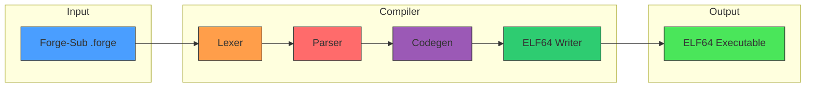
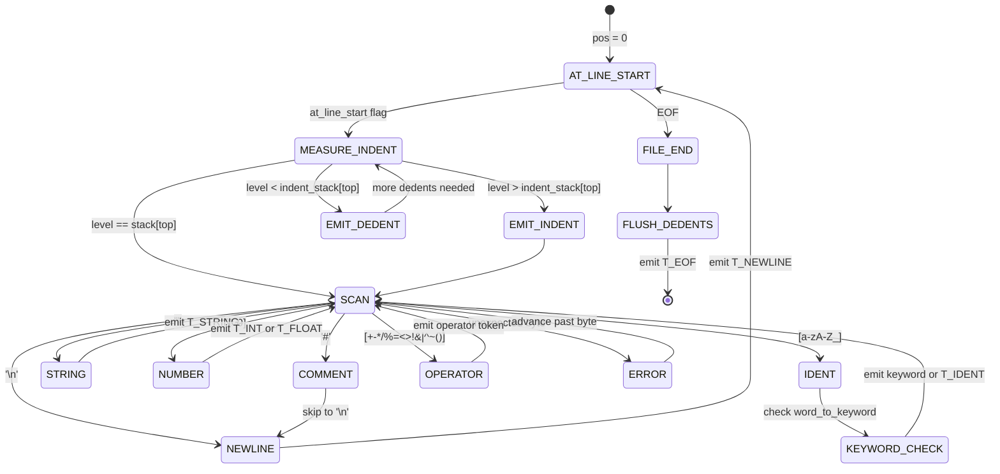
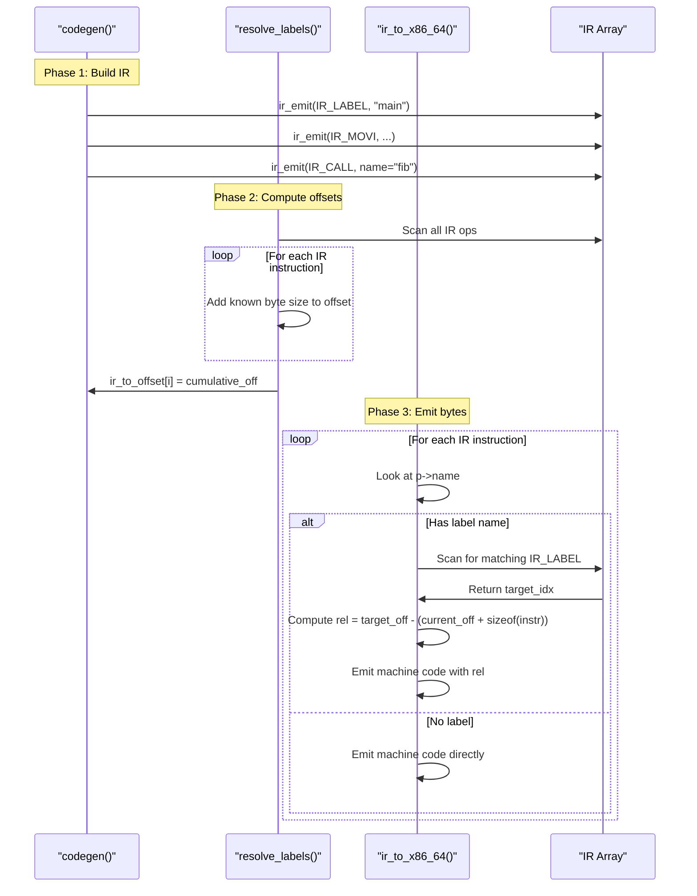
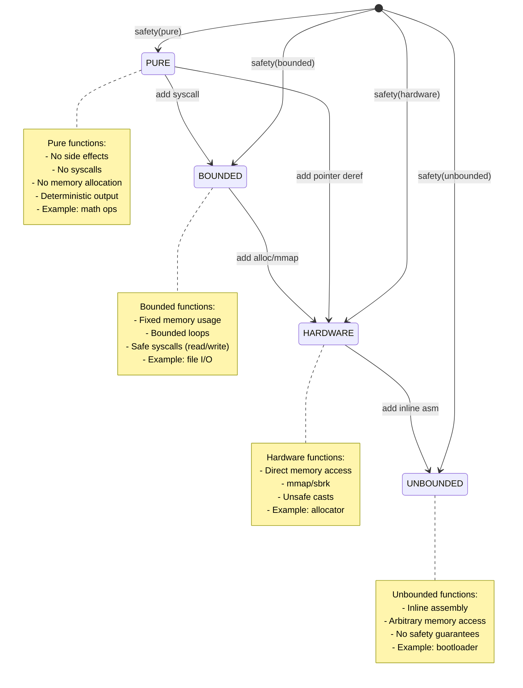
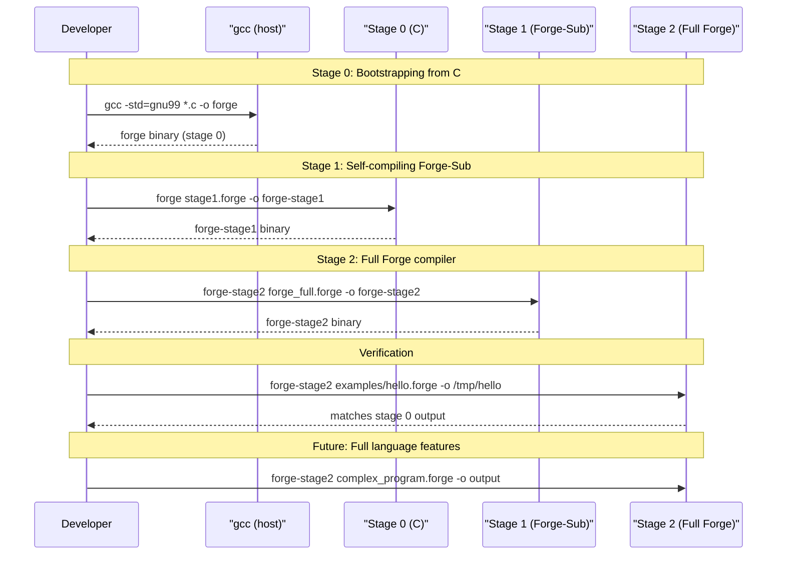

# ⚙️ FORGE ARCHITECTURE

```text
╔══════════════════════════════════════════════════════════════════════════════╗
║                           FORGE  ARCHITECTURE                              ║
║                    Stage 0 Bootstrap Compiler (Forge-Sub)                    ║
║                                                                              ║
║     ┌──────────────────────────────────────────────────────────────────┐     ║
║     │  C99  │  x86_64  │  ELF64  │  Self-Hosting  │  Zero Dependencies │     ║
║     └──────────────────────────────────────────────────────────────────┘     ║
╚══════════════════════════════════════════════════════════════════════════════╝
```


---

## 📋 Table of Contents

1. [Overview](#-overview)
2. [Design Principles](#-design-principles)
3. [Pipeline Architecture](#-pipeline-architecture)
4. [Data Structures Deep Dive](#-data-structures-deep-dive)
5. [Lexer (lexer.c)](#-lexer-lexerc)
6. [Parser (parser.c)](#-parser-parserc)
7. [Codegen (codegen.c)](#-codegen-codegenc)
8. [Memory Layout](#-memory-layout)
9. [Calling Convention](#-calling-convention)
10. [Safety System](#-safety-system)
11. [Bootstrap Plan](#-bootstrap-plan)
12. [File-by-File Reference](#-file-by-file-reference)
13. [Glossary](#-glossary)

---

## 🔭 Overview

**Forge** is a self-hosting systems programming language that combines the raw power
of x86_64 assembly with a Python-like indentation-sensitive syntax and a formal
safety annotation system. Stage 0 (this compiler) is written in **C99**, compiles
Forge-Sub source files directly into **ELF64 x86_64 executables**, and requires
**zero external dependencies** beyond a C compiler.



<details>
<summary><strong>💡 Quick Facts</strong></summary>

| Attribute | Value |
|-----------|-------|
| **Language** | C99 (gnu99 dialect) |
| **Target Architecture** | x86_64 (AMD64) |
| **Output Format** | ELF64 executable |
| **Bootstrap Strategy** | 3 stages: C → Forge-Sub → Full Forge |
| **Lines of Code (Stage 0)** | ~1,350 (C source) |
| **Dependencies** | None (libc only) |
| **Compilation Speed** | ~milliseconds (single-pass, no optimization) |
| **Memory Limit** | 4 MB source, 65,536 tokens, 131,072 IR ops |

</details>

---

## 🎯 Design Principles

| # | Principle | Description | Evidence in Code |
|---|-----------|-------------|------------------|
| 1 | **Simplicity** | The compiler must be understandable by one person. No unnecessary abstractions. | Single header (`forge.h`), 4 `.c` files, no build system beyond a 29-line `Makefile`. All major data structures are plain C arrays with maximum sizes. |
| 2 | **Speed** | Compilation must feel instant. No optimization passes, no SSA construction, no graph coloring. | Single-pass lexing (`lexer.c:56`), recursive-descent parsing (`parser.c:759`), direct IR→machine code mapping (`codegen.c:128`). |
| 3 | **Safety** | The language itself enforces memory and type safety via annotations that compile down to runtime checks. | `safety()` annotation (`forge.h:22-23`, `parser.c:133-149`), typestate declarations (`forge.h:72`, `parser.c:499-516`). |
| 4 | **Self-Hosting** | Stage 0 is written in C and compiles Forge-Sub. Stage 1 is written in Forge-Sub. Stage 2 is full Forge. | `cat.toml:15-18` defines the three-stage bootstrap plan. |
| 5 | **Zero Dependencies** | The compiler links only against libc. No LLVM, no libffi, no external assembler. | `Makefile:3` has `LDFLAGS =` (empty). ELF64 output is written manually (`codegen.c:686-721`). |

> "A compiler is a program that translates another program. The simpler the translator, the easier it is to trust the translation." — Forge Design Manifesto

---

## 🔄 Pipeline Architecture

The compiler processes source code through four distinct stages. Each stage transforms its input into a well-defined intermediate representation that feeds the next.

```mermaid
flowchart LR
    subgraph Source[Source Code]
        A[.forge file<br/>ASCII text]
    end
    
    subgraph Stage1[Phase 1: Lexing]
        L[Lexer<br/>lexer.c]
        T["Token Stream<br/>Token[65536]"]
    end
    
    subgraph Stage2[Phase 2: Parsing]
        P[Parser<br/>parser.c]
        AST[Abstract Syntax Tree<br/>Node* tree]
    end
    
    subgraph Stage3[Phase 3: Code Generation]
        IR["IR Array<br/>IR[131072]"]
        X64[x86_64 Machine Code<br/>uint8_t*]
    end
    
    subgraph Stage4[Phase 4: ELF Writer]
        E[ELF64 Writer<br/>emit_catarch_binary]
        B[Executable Binary]
    end
    
    A --"fread()"--> L
    L --"lex() → c->tokens[]"--> T
    T --"parse_program()"--> P
    P --"AST construction"--> AST
    AST --"codegen()"--> IR
    IR --"ir_to_x86_64()"--> X64
    X64 --"emit_catarch_binary()"--> E
    E --"fwrite()"--> B
    
    style A fill:#4a9eff,stroke:#333
    style T fill:#ff9e4a,stroke:#333
    style AST fill:#9b59b6,stroke:#333
    style X64 fill:#e74c3c,stroke:#333
    style B fill:#2ecc71,stroke:#333
    style L fill:#f1c40f,stroke:#333
    style P fill:#e67e22,stroke:#333
    style IR fill:#1abc9c,stroke:#333
    style E fill:#34495e,stroke:#333
```



**Data Flow Summary:**

| Step | Input | Output | Key Function | Format |
|------|-------|--------|-------------|--------|
| 1 | `.forge` file bytes | Token array | `lex()` at `lexer.c:56` | `Token[65536]` in `Compiler.tokens` |
| 2 | Token array | AST root node | `parse_program()` at `parser.c:759` | Heap-allocated `Node*` tree |
| 3 | AST root | IR instruction array | `codegen()` at `codegen.c:590` | `IR[131072]` static array |
| 4 | IR array | x86_64 bytecode | `ir_to_x86_64()` at `codegen.c:128` | `uint8_t*` dynamic buffer |
| 5 | x86_64 bytecode | ELF64 file on disk | `emit_catarch_binary()` at `codegen.c:669` | ELF64 file structure |

### Pipeline Data Formats

```
Source  ─────────────────────────────────────────────>  Token[]
  (bytes: char[4MB])                                       (struct: 65536 × 40 bytes)
                                                           │
                                                           ▼
Token[] ─────────────────────────────────────────────>  AST Node*
  (array in Compiler)                                       (heap-allocated tree)
                                                           │
                                                           ▼
AST Node* ──────────────────────────────────────────>  IR[]
  (recursive walk)                                         (struct: 131072 × 48 bytes)
                                                           │
                                                           ▼
IR[] ──────────────────────────────────────────────>  x86_64 bytes
  (linear translation)                                     (uint8_t*: dynamic)
                                                           │
                                                           ▼
x86_64 bytes ─────────────────────────────────────>  ELF64 file
  (header + code)                                          (bytes on disk)
```

---

## 🏗️ Data Structures Deep Dive

### Token Structure

Defined in `forge.h:39-47`. Tokens are the atomic units produced by the lexer and consumed by the parser.

```c
typedef struct {
    TokenKind kind;
    int64_t   int_val;
    double    float_val;
    char*     str_val;
    int       line;
    int       col;
    int       offset; /* byte offset in source */
} Token;
```

| Field | Type | Purpose | Used When |
|-------|------|---------|-----------|
| `kind` | `TokenKind` | Discriminator — identifies which token this is | Always checked by parser |
| `int_val` | `int64_t` | Integer value for `T_INT`, `T_HEX`, `T_BIN` | `TokenKind == T_INT` |
| `float_val` | `double` | Floating-point value for `T_FLOAT` | `TokenKind == T_FLOAT` |
| `str_val` | `char*` | Owned string for `T_IDENT`, `T_STRING` | `TokenKind == T_IDENT` or `T_STRING` |
| `line` | `int` | 1-based source line number | Error reporting |
| `col` | `int` | 1-based source column number | Error reporting |
| `offset` | `int` | Byte offset from start of source | Diagnostics |

<details>
<summary><strong>All 70+ Token Kinds — Complete Reference</strong></summary>

#### 📦 Delimiters

| Token Kind | Value | Source | Example |
|-----------|-------|--------|---------|
| `D_LPAREN` | `(` | `lexer.c:309` | `(` |
| `D_RPAREN` | `)` | `lexer.c:310` | `)` |
| `D_LBRACK` | `[` | `lexer.c:311` | `[` |
| `D_RBRACK` | `]` | `lexer.c:312` | `]` |
| `D_LBRACE` | `{` | `lexer.c:313` | `{` |
| `D_RBRACE` | `}` | `lexer.c:314` | `}` |
| `D_COMMA` | `,` | `lexer.c:315` | `,` |
| `D_COLON` | `:` | `lexer.c:316` | `:` |
| `D_SEMI` | `;` | `lexer.c:317` | `;` |
| `D_DOT` | `.` | `lexer.c:318` | `.` |
| `D_ARROW` | `->` | `lexer.c:290-293` | `->` |
| `D_AT` | `@` | `lexer.c:319` | `@` |

#### ➗ Arithmetic Operators

| Token Kind | Precedence | Source Example |
|-----------|-----------|----------------|
| `O_PLUS` | 7 (TERM) | `a + b` |
| `O_MINUS` | 7 (TERM) | `a - b` |
| `O_STAR` | 8 (FACTOR) | `a * b` |
| `O_SLASH` | 8 (FACTOR) | `a / b` |
| `O_PERCENT` | 8 (FACTOR) | `a % b` |

#### 🔀 Comparison Operators

| Token Kind | Precedence | Source Example |
|-----------|-----------|----------------|
| `O_EQ` | 4 (EQ) | `a == b` |
| `O_NE` | 4 (EQ) | `a != b` |
| `O_LT` | 5 (CMP) | `a < b` |
| `O_GT` | 5 (CMP) | `a > b` |
| `O_LE` | 5 (CMP) | `a <= b` |
| `O_GE` | 5 (CMP) | `a >= b` |

#### ⚡ Bitwise & Logical Operators

| Token Kind | Precedence | Source Example |
|-----------|-----------|----------------|
| `O_AND` | 2 (BITAND) | `a & b` |
| `O_OR` | 6 (BITOR) | `a \| b` |
| `O_XOR` | 5 (BITXOR) | `a ^ b` |
| `O_SHL` | 6 (SHIFT) | `a << b` |
| `O_SHR` | 6 (SHIFT) | `a >> b` |
| `O_NOT` | — (unary) | `~a` |
| `O_BANG` | — (unary) | `!a` |
| `O_AND_AND` | 2 (AND) | `a && b` |
| `O_OR_OR` | 1 (OR) | `a \|\| b` |

#### 📝 Assignment Operators

| Token Kind | Source Example |
|-----------|----------------|
| `O_ASSIGN` | `a = b` |
| `O_PLUS_EQ` | `a += b` |
| `O_MINUS_EQ` | `a -= b` |
| `O_STAR_EQ` | `a *= b` |

#### 🔑 Keywords (47 total)

| Keyword | Token Kind | Category |
|---------|-----------|----------|
| `fn` | `K_FN` | Declaration |
| `let` | `K_LET` | Declaration |
| `var` | `K_VAR` | Declaration |
| `const` | `K_CONST` | Declaration |
| `pub` | `K_PUB` | Visibility |
| `struct` | `K_STRUCT` | Type declaration |
| `if` | `K_IF` | Control flow |
| `else` | `K_ELSE` | Control flow |
| `while` | `K_WHILE` | Control flow |
| `for` | `K_FOR` | Control flow |
| `in` | `K_IN` | Control flow |
| `return` | `K_RETURN` | Control flow |
| `break` | `K_BREAK` | Control flow |
| `continue` | `K_CONTINUE` | Control flow |
| `asm` | `K_ASM` | Inline assembly |
| `volatile` | `K_VOLATILE` | Assembly qualifier |
| `safety` | `K_SAFETY` | Annotation |
| `pure` | `K_PURE` | Safety level 0 |
| `bounded` | `K_BOUNDED` | Safety level 1 |
| `hardware` | `K_HARDWARE` | Safety level 2 |
| `unbounded` | `K_UNBOUNDED` | Safety level 3 |
| `typestate` | `K_TYPESTATE` | Declaration |
| `true` / `false` | `K_TRUE` / `K_FALSE` | Literal |
| `import` | `K_IMPORT` | Module system |
| `cast` | `K_CAST` | Type operation |
| `layout` | `K_LAYOUT` | Struct attribute |
| `packed` | `K_PACKED` | Struct attribute |
| `sizeof` | `K_SIZE_OF` | Built-in |
| `addr_of` | `K_ADDR_OF` | Built-in |
| `undefined` | `K_UNDEFINED` | Sentinel |

#### 🏷️ Type Keywords

| Token Kind | C Type Mapping | Size (bytes) |
|-----------|---------------|-------------|
| `T_U8` | `uint8_t` | 1 |
| `T_U16` | `uint16_t` | 2 |
| `T_U32` | `uint32_t` | 4 |
| `T_U64` | `uint64_t` | 8 |
| `T_I8` | `int8_t` | 1 |
| `T_I16` | `int16_t` | 2 |
| `T_I32` | `int32_t` | 4 |
| `T_I64` | `int64_t` | 8 |
| `T_BOOL` | `uint8_t` | 1 |
| `T_VOID` | — | 0 |
| `T_USIZE` | `uint64_t` | 8 |
| `T_PTR` | Pointer | 8 |
| `T_SLICE` | `{ptr, len}` | 16 |

#### 🏁 Special Tokens

| Token Kind | Purpose |
|-----------|---------|
| `T_EOF` | End of file sentinel |
| `T_NEWLINE` | Statement terminator |
| `T_INDENT` | Block start |
| `T_DEDENT` | Block end |
| `B_ERROR` | Error sentinel (value 255) |

</details>

---

### AST Node Structure

Defined in `forge.h:61-90`. The AST is a tree of dynamically-typed nodes connected through a C `union`.

```c
typedef struct Node {
    NodeKind kind;
    int      line, col;
    union {
        struct { struct Node** stmts; int count; } program;
        struct {
            char* name; struct Node** params; int pcount;
            struct Node* ret_type; struct Node* body;
            struct Node* safety; int is_pub;
        } func;
        struct { char* name; struct Node** fields; int fcount; int packed; } struct_decl;
        struct { char* name; char** states; int scount; } typestate;
        struct { char* name; struct Node* type; struct Node* init; int is_mut; int is_const; } var;
        struct { char* path; } import;
        struct { struct Node* cond; struct Node* body; struct Node* else_body; struct Node* init; struct Node* iter; char* loop_var; } flow;
        struct { struct Node* val; } ret;
        struct { char** lines; int count; int is_volatile; } asm_block;
        struct { struct Node** stmts; int count; } block;
        struct { char* name; char* val; } data;
        struct { struct Node* target; struct Node* val; int op; } assign;
        struct { struct Node* callee; struct Node** args; int acount; } call;
        struct { struct Node* obj; struct Node* idx; } index_;
        struct { struct Node* obj; char* field; } field;
        struct { struct Node* l; struct Node* r; int op; } binary;
        struct { struct Node* op; int op_kind; } unary;
        struct { struct Node* expr; struct Node* type; } cast;
        struct { int level; } safety;
        int64_t i_val; double f_val; char* s_val; int b_val;
    } as;
} Node;
```

<details>
<summary><strong>All 26 Node Types — Complete Reference</strong></summary>

| NodeKind | Union Struct | Key Fields | Source Example |
|----------|-------------|------------|----------------|
| `N_PROGRAM` | `program` | `stmts[]`, `count` | Root of every parse tree |
| `N_FUNC` | `func` | `name`, `params[]`, `pcount`, `ret_type`, `body`, `safety`, `is_pub` | `fn main() -> i64:` |
| `N_STRUCT_DECL` | `struct_decl` | `name`, `fields[]`, `fcount`, `packed` | `struct Point:` |
| `N_TYPESTATE_DECL` | `typestate` | `name`, `states[]`, `scount` | `typestate File: Open, Closed` |
| `N_LET` | `var` | `name`, `type`, `init`, `is_mut=0`, `is_const=0` | `let x: i32 = 5` |
| `N_VAR` | `var` | `name`, `type`, `init`, `is_mut=1`, `is_const=0` | `var x: i32 = 5` |
| `N_CONST` | `var` | `name`, `type`, `init`, `is_mut=0`, `is_const=1` | `const MAX: i32 = 100` |
| `N_IMPORT` | `import` | `path` | `import "std/io"` |
| `N_IF` | `flow` | `cond`, `body`, `else_body` | `if x > 0:` |
| `N_WHILE` | `flow` | `cond`, `body` | `while running:` |
| `N_FOR` | `flow` | `loop_var`, `iter`, `body` | `for x in range:` |
| `N_BREAK` | — | (none) | `break` |
| `N_CONTINUE` | — | (none) | `continue` |
| `N_RETURN` | `ret` | `val` | `return 0` |
| `N_ASM_BLOCK` | `asm_block` | `lines[]`, `count`, `is_volatile` | `asm volatile:` |
| `N_BLOCK` | `block` | `stmts[]`, `count` | Indented block body |
| `N_ASSIGN` | `assign` | `target`, `val`, `op` | `x = 5`, `x += 1` |
| `N_CALL` | `call` | `callee`, `args[]`, `acount` | `fib(10)` |
| `N_INDEX` | `index_` | `obj`, `idx` | `arr[0]` |
| `N_FIELD` | `field` | `obj`, `field` | `point.x` |
| `N_BINARY` | `binary` | `l`, `r`, `op` | `a + b` |
| `N_UNARY` | `unary` | `op`, `op_kind` | `-x`, `!flag` |
| `N_CAST` | `cast` | `expr`, `type` | `cast(u32, x)` |
| `N_INT` | `i_val` | `int64_t` | `42`, `0xFF` |
| `N_FLOAT` | `f_val` | `double` | `3.14` |
| `N_STRING` | `s_val` | `char*` | `"hello"` |
| `N_BOOL` | `b_val` | `int` | `true`, `false` |
| `N_IDENT` | `s_val` | `char*` | Variable/function name |
| `N_ARRAY_LIT` | `program` (reused) | `stmts[]`, `count` | `[1, 2, 3]` |
| `N_ADDR_OF` | `unary` | `op` | `addr_of(x)` |
| `N_SIZE_OF` | `unary` | `op` | `sizeof(u32)` |
| `N_DEREF` | `unary` | `op` | `*ptr` |
| `N_SAFETY_ANN` | `safety` | `level` (0-3) | `safety(pure)` |
| `N_DATA` | `data` | `name`, `val` | `:msg "Hello\n"` |

</details>

---

### IR Instruction Structure

Defined in `codegen.c:21-26`. The IR is a flat array of RISC-like ops that bridge the AST and x86_64 machine code.

```c
typedef struct {
    IROp op;
    int a, b;          /* register operands */
    int64_t imm;       /* immediate / target IR index for branches */
    char* name;        /* label/string name */
} IR;
```

| Field | Type | Purpose |
|-------|------|---------|
| `op` | `IROp` | Opcode discriminator |
| `a` | `int` | Destination register or first operand |
| `b` | `int` | Source register or second operand |
| `imm` | `int64_t` | Immediate value OR target IR index for branches/data |
| `name` | `char*` | Label name, function name, or string data |

#### IR Ops — Complete Translation Table

Defined in `codegen.c:10-18` (enum `IROp`), translated in `codegen.c:128-285` (`ir_to_x86_64()`).

| IR Op | x86_64 Encoding | Bytes | Notes |
|-------|----------------|-------|-------|
| `IR_NOP` | `90` | 1 | xchg eax,eax |
| `IR_MOVI` | `48 C7 /0 id` or `48 B8+rd iq` | 7 or 9 | 32-bit imm; 64-bit for rax with large values |
| `IR_MOV` | `48 89 /r` | 3 | Register-to-register move |
| `IR_MOVHI` | *handled by MOVI* | — | Full 64-bit immediate fallback |
| `IR_LEA` | `48 8D /r (modrm)` | 7 | RIP-relative or absolute |
| `IR_LOAD` | *placeholder* | — | Not yet implemented |
| `IR_STORE` | *placeholder* | — | Not yet implemented |
| `IR_PUSH` | `50+rd` | 1 | Push register |
| `IR_POP` | `58+rd` | 1 | Pop register |
| `IR_ADD` | `48 01 /r` | 3 | r/m64 += r64 |
| `IR_SUB` | `48 29 /r` | 3 | r/m64 -= r64 |
| `IR_IMUL` | `48 0F AF /r` | 4 | Signed multiply |
| `IR_AND` | `48 21 /r` | 3 | r/m64 &= r64 |
| `IR_OR` | `48 09 /r` | 3 | r/m64 \|= r64 |
| `IR_XOR` | `48 31 /r` | 3 | r/m64 ^= r64 |
| `IR_SHL` | `48 D3 /4` | 3 | Shift left (cl as count) |
| `IR_SHR` | `48 D3 /5` | 3 | Shift right (cl) |
| `IR_SAR` | *placeholder* | — | Arithmetic shift right |
| `IR_CMP` | `48 39 /r` | 3 | Compare registers |
| `IR_CMPI` | `48 81 /7 id` | 7 | Compare with immediate |
| `IR_JMP` | `E9 rel32` | 5 | Unconditional near jump |
| `IR_JE` | `0F 84 rel32` | 6 | Jump if equal |
| `IR_JNE` | `0F 85 rel32` | 6 | Jump if not equal |
| `IR_JL` | `0F 8C rel32` | 6 | Jump if less (signed) |
| `IR_JLE` | `0F 8E rel32` | 6 | Jump if less or equal |
| `IR_JG` | `0F 8F rel32` | 6 | Jump if greater (signed) |
| `IR_JGE` | `0F 8D rel32` | 6 | Jump if greater or equal |
| `IR_JZ` | `0F 84 rel32` | 6 | Same as JE |
| `IR_JNZ` | `0F 85 rel32` | 6 | Same as JNE |
| `IR_CALL` | `E8 rel32` | 5 | Near call |
| `IR_RET` | `C3` | 1 | Near return |
| `IR_SYSCALL` | `0F 05` | 2 | syscall instruction |
| `IR_HALT` | `F4` | 1 | hlt instruction |
| `IR_LABEL` | *(none)* | 0 | Pseudo-op, zero bytes |
| `IR_DATA_BYTE` | raw byte | 1 | Emitted verbatim |
| `IR_DATA_STRING` | raw bytes + `00` | N+1 | String + null terminator |

> **Design Decision:** The IR is intentionally flat and simple — no basic blocks, no CFG, no SSA. Each IR op maps to exactly 1-6 x86_64 bytes determined at label-resolution time. Forward references are resolved by scanning the entire IR array twice (see [Label Resolution](#-label-resolution-algorithm) below).

---

### Compiler Context Structure

Defined in `forge.h:93-118`. This is the central "god object" threaded through every phase.

```c
typedef struct {
    char*     src;            /* Source buffer */
    size_t    src_len;        /* Source length */
    Token     tokens[MAX_TOKENS]; /* Token array (max 65536) */
    int       ntokens;        /* Token count */
    int       pos;            /* Current position (lex: src index, parse: token index) */
    char      filename[256];  /* Input file path (for error messages) */
    
    /* Label table */
    char      labels[MAX_LABELS][64];    /* Label names (max 4096) */
    int       label_addrs[MAX_LABELS];   /* Resolved addresses */
    int       nlabels;                   /* Label count */
    
    /* Function table */
    char      func_names[MAX_FUNCS][64]; /* Function names (max 1024) */
    Node*     func_nodes[MAX_FUNCS];     /* Function AST nodes */
    int       nfuncs;                    /* Function count */
    int       current_func;              /* Currently compiling (-1 if none) */
    
    /* String table */
    char*     strings[MAX_STRINGS];     /* String literals (max 1024) */
    int       string_addrs[MAX_STRINGS]; /* Addresses */
    int       nstrings;                 /* String count */
    
    /* Code buffer */
    uint8_t*  code;          /* Emitted machine code */
    int       code_cap;      /* Capacity */
    int       code_len;      /* Current length */
    
    /* Fixup table (unused in Stage 0) */
    int       fixup_offsets[65536];
    int       fixup_labels[65536];
    int       nfixups;
    
    /* Error state */
    int       nerrors;       /* Error count */
    char      error_msg[1024]; /* Last error message */
} Compiler;
```

#### Field Responsibilities by Phase

| Phase | Fields Used | Purpose |
|-------|-------------|---------|
| **Lexer** | `src`, `src_len`, `pos` | Read source bytes |
| | `tokens[]`, `ntokens` | Write token stream |
| **Parser** | `tokens[]`, `ntokens`, `pos` | Read token stream |
| | `func_names[]`, `func_nodes[]`, `nfuncs` | Register function declarations |
| | `nerrors`, `error_msg`, `filename` | Error reporting |
| **Codegen** | `code`, `code_cap`, `code_len` | Output machine code |
| | `labels[]`, `label_addrs[]`, `nlabels` | Label resolution (legacy) |
| | `strings[]`, `string_addrs[]`, `nstrings` | String table |
| **ELF Writer** | `code`, `code_len` | Read code buffer |

> **Design Decision:** The `Compiler` struct uses fixed-size arrays rather than dynamic data structures. This keeps the implementation simple and the memory footprint predictable. The tradeoff is hard limits: 65,536 tokens, 4,096 labels, 1,024 functions. These are generous for a bootstrap compiler.

---

## 🔤 Lexer (lexer.c)

The lexer transforms raw source bytes into a flat array of tokens, handling indentation-based block structure in the process.

### State Machine



### Token Kind Categories

| Category | Count | Token Kinds |
|----------|-------|-------------|
| **Structural** | 5 | `T_EOF`, `T_NEWLINE`, `T_INDENT`, `T_DEDENT`, `B_ERROR` |
| **Literals** | 5 | `T_IDENT`, `T_INT`, `T_HEX`, `T_BIN`, `T_FLOAT`, `T_STRING` |
| **Keywords** | 47 | `K_FN` through `K_PUB` (including type names) |
| **Operators** | 22 | `O_PLUS` through `O_OR_OR` |
| **Delimiters** | 11 | `D_LPAREN` through `D_AT` |

### Indentation Tracking Algorithm

The indentation system is stack-based, similar to Python's. The lexer maintains an `indent_stack[]` in `lexer.c:61-63`.

```
Algorithm: indent_dedent (at line start)

  Input:  source position pos, indent_stack, indent_top
  Output: zero or more T_INDENT/T_DEDENT tokens

  1. Measure whitespace:
     level = 0
     while ch == ' ' or ch == '\t':
         if ch == '\t': level += 8
         else:          level += 1
         pos++

  2. Check for blank/comment line:
     if line is empty or starts with '#':
         skip entire line, return to line start without emitting

  3. Adjust indent stack:
     if level > indent_stack[top]:
         emit T_INDENT
         push level onto indent_stack
     else:
         while level < indent_stack[top]:
             emit T_DEDENT
             pop indent_stack
```

#### Example Indentation Walkthrough

```text
Source:
    ┌─1: fn main():          indent_stack = [0]
    ├─2:     asm volatile:   → T_INDENT (level=4, stack=[0,4])
    ├─3:         mov rax, 1  → T_INDENT (level=8, stack=[0,4,8])
    ├─4:         syscall     (same level)
    ├─5:     return 0        → T_DEDENT (level=4, stack=[0,4])
    └─6:                     → T_DEDENT (level=0, stack=[0])

Token stream emitted:
    T_IDENT("fn") T_IDENT("main") D_LPAREN D_RPAREN D_COLON T_NEWLINE
    T_INDENT       (level 4)
    T_IDENT("asm") T_IDENT("volatile") D_COLON T_NEWLINE
    T_INDENT       (level 8)
    T_IDENT("mov") T_IDENT("rax") D_COMMA T_INT(1) T_NEWLINE
    T_IDENT("syscall") T_NEWLINE
    T_DEDENT       (end of asm)
    T_IDENT("return") T_INT(0) T_NEWLINE
    T_DEDENT       (end of fn)
    T_EOF
```

### Keyword Table with x86_64 Mnemonic Mapping

The keyword table in `lexer.c:32-53` (`word_to_keyword()`) maps 47 string → `TokenKind` pairs. Notably, x86_64 mnemonics like `mov`, `add`, `sub`, `cmp`, `jmp`, `je`, `jne`, `jl`, `jle`, `jg`, `jge`, `jz`, `jnz`, `xor`, `syscall`, `ret`, `push`, `pop`, `lea`, `dec`, `inc`, `call`, `int` are **NOT** keywords — they are parsed as regular `T_IDENT` tokens inside `asm` blocks. The parser's `parse_asm_block()` at `parser.c:551-597` reconstructs these identifiers back into assembly lines.

### `next_token()` Flow

The main lexer function `lex()` at `lexer.c:56-353` operates as a single pass:

```
lex(Compiler* c):
  ┌─ Initialize: indent_stack = [0], at_line_start = 1, nt = 0
  │
  ├── Main loop (while c->pos < c->src_len):
  │   │
  │   ├── if at_line_start:
  │   │   ├── Measure whitespace → level
  │   │   ├── Check blank/comment line → skip if so
  │   │   ├── if level > stack[top] → emit T_INDENT, push level
  │   │   └── else → while level < stack[top] → emit T_DEDENT, pop
  │   │
  │   ├── Skip inline whitespace (space/tab)
  │   │
  │   ├── '\n' → emit T_NEWLINE, set at_line_start = 1
  │   ├── '#'  → skip to '\n' (comment)
  │   ├── '"'  → scan string with escape handling → emit T_STRING
  │   ├── '0'  → check for 0x (hex) or 0b (binary) → emit T_INT
  │   ├── [0-9]→ scan decimal/float → emit T_INT or T_FLOAT
  │   ├── [a-zA-Z_] → scan identifier → check keyword table → emit keyword or T_IDENT
  │   ├── '==','!=','<=','>=','<<','>>','&&','||','+=','->','-=','*=' → emit multi-char op
  │   └── single char → switch dispatch → emit operator/delimiter
  │
  ├── Close remaining indents → emit T_DEDENT until stack[0]
  │
  └── Emit T_EOF
```

---

## 🧩 Parser (parser.c)

The parser is a **recursive-descent, hand-written, precedence-climbing** parser. It consumes the token stream and produces a dynamically-typed AST.

### Grammar (EBNF Notation)

```text
program         = { import_decl | func_decl | struct_decl | typestate_decl } ;
import_decl     = "import" T_IDENT [ T_NEWLINE ] ;
func_decl       = [ "pub" ] "fn" T_IDENT "(" [ params ] ")" [ "->" type ] [ safety_ann ] ":" block ;
params          = param { "," param } ;
param           = T_IDENT ":" type ;
struct_decl     = "struct" T_IDENT [ "layout" "(" "packed" ")" ] ":" newline indent { field } dedent ;
field           = T_IDENT ":" type newline ;
typestate_decl  = "typestate" T_IDENT ":" T_IDENT { "," T_IDENT } newline ;
safety_ann      = "safety" "(" ( "pure" | "bounded" | "hardware" | "unbounded" ) ")" ;

block           = ":" newline indent { stmt } dedent ;
stmt            = func_decl
                | struct_decl
                | typestate_decl
                | ( "let" | "var" | "const" ) T_IDENT [ ":" type ] [ "=" expr ] newline
                | "return" [ expr ] newline
                | "break" newline
                | "continue" newline
                | "if" expr block [ "else" ( "if" expr block | block ) ]
                | "while" expr block
                | "for" T_IDENT "in" expr block
                | "asm" [ "volatile" ] ":" [ newline indent { asm_line } dedent ]
                | ":" T_IDENT ( T_STRING | newline T_STRING ) newline    (* data label *)
                | expr newline ;

expr            = assignment ;
assignment      = primary { "(" args ")" | "[" expr "]" | "." T_IDENT }
                  [ assign_op assignment ] ;
primary         = T_INT | T_FLOAT | T_STRING | "true" | "false"
                | T_IDENT | "(" expr ")"
                | "[" [ expr { "," expr } ] "]"
                | "cast" "(" type "," expr ")"
                | "addr_of" primary | "sizeof" "(" type ")"
                | "-" primary | "!" primary | "*" primary
                | "{" [ T_IDENT ":" expr { "," T_IDENT ":" expr } ] "}" ;

type            = "*" type                (* pointer type *)
                | "[" "]" type            (* slice type *)
                | T_IDENT                 (* named type *)
                | type_keyword ;          (* u8..u64, i8..i64, bool, void, usize *)

assign_op       = "=" | "+=" | "-=" | "*=" ;
```

### Parse Flow

```mermaid
flowchart TD
    Start(["parse_program()"])
    Start --> Loop{Token != T_EOF?}
    Loop -->|T_NEWLINE| Advance[advance()]
    Advance --> Loop
    Loop -->|T_DEDENT| Advance2[advance()]
    Advance2 --> Loop
    Loop -->|Decl| ParseStmt
    
    ParseStmt["parse_stmt()"] --> CheckFn{fn or pub fn?}
    CheckFn -->|Yes| ParseFunc["parse_func_decl()"]
    ParseFunc --> Register["Register in func_names[]"]
    
    ParseStmt --> CheckStruct{struct?}
    CheckStruct -->|Yes| ParseStruct["parse_struct_decl()"]
    
    ParseStmt --> CheckTypestate{typestate?}
    CheckTypestate -->|Yes| ParseTypestate["parse_typestate_decl()"]
    
    ParseStmt --> CheckLet{let/var/const?}
    CheckLet -->|Yes| ParseVar
    
    ParseStmt --> CheckImport{import?}
    CheckImport -->|Yes| ParseImport
    
    ParseStmt --> CheckReturn{return?}
    CheckReturn -->|Yes| ParseReturn
    
    ParseStmt --> CheckBreak{break/continue?}
    CheckBreak -->|Yes| EmitBreak
    
    ParseStmt --> CheckData{:label?}
    CheckData -->|Yes| ParseData
    
    ParseStmt --> CheckAsm{asm?}
    CheckAsm -->|Yes| ParseAsmBlock
    
    ParseStmt --> CheckIf{if?}
    CheckIf -->|Yes| ParseIf["parse_expr() + parse_block()"]
    
    ParseStmt --> CheckWhile{while?}
    CheckWhile -->|Yes| ParseWhile
    
    ParseStmt --> CheckFor{for?}
    CheckFor -->|Yes| ParseFor
    
    ParseStmt --> ExprStmt["parse_expr()"]
    ExprStmt --> Loop
    
    ParseIf --> ElseCheck{else?}
    ElseCheck -->|Yes| ParseElse
    ElseCheck -->|No| Loop
    
    subgraph Expr[Expression Parser]
        PA["parse_assignment()"]
        PA --> Primary["parse_primary()"]
        Primary --> PostfixLoop{postfix?}
        PostfixLoop -->|"("| Call["parse_call()"]
        PostfixLoop -->|"["| Index["parse_index()"]
        PostfixLoop -->|"."| Field["parse_field()"]
        PostfixLoop -->|None| BinLoop{precedence >= min?}
        BinLoop -->|Yes| ParseRight["parse_primary()"]
        ParseRight --> Chain{next prec > current?}
        Chain -->|Yes| AdvanceParse
        Chain -->|No| BuildNode["N_BINARY"]
        BinLoop -->|No| Done["return left"]
    end
```

### Precedence Climbing

The expression parser uses the **precedence climbing** method (`parser.c:152-171`):

| Level | Name | Operators |
|-------|------|-----------|
| 0 | `PREC_MIN` | (sentinels) |
| 1 | `PREC_ASSIGN` | `=`, `+=`, `-=`, `*=` |
| 2 | `PREC_OR` | `\|\|` |
| 3 | `PREC_AND` | `&&` |
| 4 | `PREC_EQ` | `==`, `!=` |
| 5 | `PREC_CMP` | `<`, `>`, `<=`, `>=` |
| 6 | `PREC_BITOR` | `\|` |
| 7 | `PREC_BITXOR` | `^` |
| 8 | `PREC_BITAND` | `&` |
| 9 | `PREC_SHIFT` | `<<`, `>>` |
| 10 | `PREC_TERM` | `+`, `-` |
| 11 | `PREC_FACTOR` | `*`, `/`, `%` |
| 12 | `PREC_UNARY` | unary `-`, `!`, `*`, `~` |
| 13 | `PREC_CALL` | `()`, `[]`, `.` |

### Asm Block Parsing (Token Reconstruction)

`parse_asm_block()` at `parser.c:551-597` is one of the most interesting parts of the parser. Since assembly syntax is line-based, the parser:

1. **Consumes tokens line-by-line** between `T_NEWLINE` markers
2. **Reconstructs text** from token kinds using `append_token_str()` at `parser.c:537-549`
3. **Applies spacing rules** to reconstruct proper assembly syntax:
   - Adds spaces after `[`, `(`, `,`, `:`
   - No space before `]`, `)`, `:`
   - Strips trailing commas (handled later in codegen at `codegen.c:449-452`)
4. **Detects labels** by checking for `:` prefix or trailing `:` on operator tokens

```text
Token Sequence:                     Reconstructed Line:
───────────────────────────────────  ───────────────────
T_IDENT("mov")   T_IDENT("rax")     "mov rax, 1"
D_COMMA          T_INT(1)           
───────────────────────────────────  ───────────────────
T_IDENT("je")    T_IDENT("_base")   "je _base"
───────────────────────────────────  ───────────────────
D_COLON          T_IDENT("_base")   ":_base"
```

### Error Recovery Strategy

The parser implements a simple error recovery strategy:

1. **`expect()`** at `parser.c:31-38`: If the expected token is missing, it prints an error message, increments `c->nerrors`, but continues parsing
2. **`print_error()`** at `parser.c:4-12`: Formats errors as `error[filename:line:col]: message` to stderr
3. **Only the first error** is reported (the `if (!c->nerrors)` guard in `expect()` at line 36)
4. **Early abort** in `main.c:81-84`: If `comp.nerrors > 0` after parsing, compilation stops before codegen

> **Design Decision:** Only the first parse error is reported to the user. This is intentionally minimal — the Stage 0 compiler prioritizes implementation simplicity over user-friendly diagnostics.

---

## ⚡ Codegen (codegen.c)

Code generation is a two-phase process:

1. **AST → IR**: Walk the AST and emit IR instructions into a flat array
2. **IR → x86_64**: Translate each IR op to its machine code bytes, resolving labels

### IR Emission Functions

| Function | Location | Purpose |
|----------|----------|---------|
| `ir_emit(op, a, b, imm)` | `codegen.c:31-36` | Emit a generic IR instruction |
| `ir_label(name)` | `codegen.c:38-42` | Emit `IR_LABEL` pseudo-op with name |
| `ir_data_string(s)` | `codegen.c:44-48` | Emit `IR_DATA_STRING` with string payload |

### Expression → IR Mapping

`expr_to_ir()` at `codegen.c:288-380` recursively compiles expressions to IR:

```text
N_INT(42)           →  IR_MOVI  r, 0, 42

N_BOOL(true)        →  IR_MOVI  r, 0, 1

N_IDENT("x")        →  IR_MOVI  r, 0, 0   (placeholder)

N_BINARY(a + b):
  reg_l = expr_to_ir(a)
  reg_r = expr_to_ir(b)
  → IR_ADD reg_l, reg_r, 0
  → return reg_l

N_BINARY(a == b):
  reg_l = expr_to_ir(a)
  reg_r = expr_to_ir(b)
  → IR_CMP  reg_l, reg_r, 0
  → IR_JNE  0, 0, __eq_skip
  → IR_MOVI r, 0, 1
  → IR_JMP  0, 0, __eq_ret
  → IR_LABEL __eq_skip
  → IR_MOVI r, 0, 0
  → IR_LABEL __eq_ret
  → return r

N_STRING("hello")   →  IR_DATA_STRING "hello"
                    →  IR_LEA  r, 0, <data_idx>

N_CALL("fib", [a]): 
  → expr_to_ir(a) → r0
  → IR_MOV rdi, r0
  → IR_CALL 0, 0, <IR_index>  [name = "fib"]
  → IR_MOV r, rax, 0
```

### Label Resolution Algorithm

Labels are resolved in `resolve_labels()` at `codegen.c:89-125` and used during `ir_to_x86_64()` at `codegen.c:128-285`.



**Label Resolution Details:**

- `resolve_labels()` (`codegen.c:89-125`) computes `ir_to_offset[i]` — the byte offset of each IR instruction in the final output, not including the ELF header.
- During `ir_to_x86_64()`, forward references are resolved by scanning the IR array for matching `IR_LABEL` or `IR_DATA_STRING` entries (e.g., `codegen.c:162-167` for `IR_LEA`, `codegen.c:211-215` for branches, `codegen.c:244-248` for calls).
- If a label is not found, the branch targets `off` (itself), creating a jump-to-next-instruction that acts as a NOP-like placeholder.

### x86_64 Instruction Encoding Details

#### REX Prefix

The `rex()` function at `codegen.c:81-84` constructs the REX prefix byte:

```
REX byte:  0100 WRXB
           ───── ────
             0x4   W R X B

W = 1 → 64-bit operand size (0x48)
R = 1 → extended ModRM.reg (r8-r15)
X = 1 → extended SIB index (r8-r15)
B = 1 → extended ModRM.r/m or base (r8-r15)
```

The prefix is only emitted when at least one bit is set (`if (v != 0x40) e1(v)`), avoiding unnecessary `0x40` bytes.

#### ModRM Byte

The `rm()` function at `codegen.c:76-78` constructs the ModRM byte:

```
ModRM:   ┌─────┬─────┬─────┐
         │ mod │ reg │ r/m │
         ├─────┼─────┼─────┤
         │ 2   │ 3   │ 3   │ bits
         └─────┴─────┴─────┘

mod=3 → register direct (no memory)
mod=0 → [r/m] memory (except r/m=5 → RIP-relative)
mod=1 → [r/m + disp8]
mod=2 → [r/m + disp32]
```

#### Example: `mov r64, imm32`

```text
Source:  mov rax, 42

IR:      IR_MOVI a=0, b=0, imm=42

Encoding (codegen.c:144-151):

  ; 42 fits in 32 bits (no large immediate needed)
  48       REX.W (64-bit operation)
  C7       MOV r/m64, imm32 opcode
  C0       ModRM: mod=3 (register), reg=0 (/0), r/m=0 (rax)
  2A 00 00 00   imm32 = 42

  Result: 48 C7 C0 2A 00 00 00 (7 bytes)
```

#### Example: `add r64, r64`

```text
Source:  add rax, rbx

IR:      IR_ADD a=0, b=3, imm=0

Encoding (codegen.c:187):

  48       REX.W
  01       ADD r/m64, r64 opcode
  D8       ModRM: mod=3, reg=3 (rbx), r/m=0 (rax)

  Result: 48 01 D8 (3 bytes)
```

#### Example: Conditional Jump

```text
Source:  je loop_start

IR:      IR_JE imm=<IR index of loop_start>

Encoding (codegen.c:224-238):

  0F 84    JE rel32 opcode
  XX XX XX XX   rel32 = target_off - (current_off + 6)

  Result: 0F 84 XX XX XX XX (6 bytes)
```

### ELF64 Writer

`emit_catarch_binary()` at `codegen.c:669-721` writes a minimal valid ELF64 executable.

```text
ELF Header (64 bytes) + Program Header (56 bytes) + Padding (8 bytes) = 128 bytes header
                                                            ────────
                                                             Total: 128 bytes
```

#### ELF Header Structure

```c
// Constructed at codegen.c:687-709
typedef struct {
    unsigned char e_ident[16];   // hdr[0..15]: 7F E L F \2 \1 \1 \0 ...
    uint16_t      e_type;        // hdr[16..17]: 2 = ET_EXEC
    uint16_t      e_machine;     // hdr[18..19]: 0x3E = x86_64
    uint32_t      e_version;     // hdr[20..23]: 1
    uint64_t      e_entry;       // hdr[24..31]: 0x400000 + 128 + entry_offset
    uint64_t      e_phoff;       // hdr[32..39]: 64 (program header offset)
    uint64_t      e_shoff;       // hdr[40..47]: 0 (section headers omitted)
    uint32_t      e_flags;       // hdr[48..51]: 0
    uint16_t      e_ehsize;      // hdr[52..53]: 64
    uint16_t      e_phentsize;   // hdr[54..55]: 56
    uint16_t      e_phnum;       // hdr[56..57]: 1
    uint16_t      e_shentsize;   // hdr[58..59]: 0
    uint16_t      e_shnum;       // hdr[60..61]: 0
    uint16_t      e_shstrndx;    // hdr[62..63]: 0
} Elf64_Ehdr;
```

#### Program Header (Single PT_LOAD Segment)

```c
// Constructed at codegen.c:700-708
typedef struct {
    uint32_t   p_type;    // 1 = PT_LOAD
    uint32_t   p_flags;   // 5 = PF_R | PF_X (read + execute)
    uint64_t   p_offset;  // 0 (file offset = vaddr - base)
    uint64_t   p_vaddr;   // 0x400000 (traditional x86_64 base)
    uint64_t   p_paddr;   // 0x400000
    uint64_t   p_filesz;  // 128 + code_len
    uint64_t   p_memsz;   // 128 + code_len
    uint64_t   p_align;   // 0x1000 (4K page)
} Elf64_Phdr;
```

#### Output Layout Calculation

```text
File offset 0:      ELF header        (64 bytes)
File offset 64:     Program header    (56 bytes)
File offset 120:    Zero padding      (8 bytes)
File offset 128:    Machine code      (code_len bytes)
                    ─────────────────
                    Total: 128 + code_len bytes
```

> **Design Decision:** The ELF writer produces a stripped, minimal executable with no section headers, no symbol table, no string table, and no relocation information. The single PT_LOAD segment maps the entire file at `0x400000` with `PF_R | PF_X` (no writable data segment — all constants are embedded in the code stream). This is valid Linux ELF, but would need extension for proper data segments.

---

## 📐 Memory Layout

### ELF Output Binary Structure

```text
┌─────────────────────────────────────────────────────────────────────────────┐
│                           ELF64 Executable Layout                            │
├─────────────────────────────────────────────────────────────────────────────┤
│                                                                              │
│  ╔═══════════════════════════════════════════════════════════════════════╗   │
│  ║                     ELF Header (64 bytes)                            ║   │
│  ║  0x7F 'E' 'L' 'F' │ 2 (64-bit) │ 1 (LE) │ 1 │ ET_EXEC │ x86_64     ║   │
│  ║  Entry: 0x400080 + main_offset  │  PHoff: 64  │  Ehsize: 64        ║   │
│  ║  Phentsize: 56  │  Phnum: 1     │  Shentsize: 0  │  Shnum: 0       ║   │
│  ╚═══════════════════════════════════════════════════════════════════════╝   │
│                                                                              │
│  ┌─────────────────────────────────────────────────────────────────────────┐ │
│  │                 Program Header (56 bytes) — PT_LOAD                      │ │
│  │  Type: 1 (LOAD)  │  Flags: 5 (R+X)  │  Offset: 0                       │ │
│  │  Vaddr: 0x400000 │  Paddr: 0x400000 │  Align: 0x1000                   │ │
│  │  Filesz: 128+code_len  │  Memsz: 128+code_len                          │ │
│  └─────────────────────────────────────────────────────────────────────────┘ │
│                                                                              │
│  ┌─────────────────────────────────────────────────────────────────────────┐ │
│  │                     Padding (8 bytes)                                    │ │
│  └─────────────────────────────────────────────────────────────────────────┘ │
│                                                                              │
│  ┌─────────────────────────────────────────────────────────────────────────┐ │
│  │                    Code Section (code_len bytes)                         │ │
│  │                                                                          │ │
│  │  0x400080:  push rbp           (IR_PUSH rbp)     [1 byte]               │ │
│  │  0x400081:  mov rbp, rsp       (IR_MOV rbp,rsp)  [3 bytes]              │ │
│  │  0x400084:  sub rsp, 0         (IR_SUB rsp,0)    [3 bytes]              │ │
│  │  ...                                                                     │ │
│  │  [main function code]                                                    │ │
│  │  ...                                                                     │ │
│  │  [data strings embedded]                                                │ │
│  │  ...                                                                     │ │
│  └─────────────────────────────────────────────────────────────────────────┘ │
│                                                                              │
│  Virtual Address Map:                                                        │
│  0x400000 ┌─────────────────────┐                                            │
│           │ ELF Header          │ 64 bytes                                   │
│  0x400040 │ Program Header      │ 56 bytes                                   │
│  0x400078 │ Padding             │ 8 bytes                                    │
│  0x400080 │ Code / Data         │ code_len bytes                             │
│  0x400080+ │                     │                                            │
│  └─────────────────────┘                                                     │
│                                                                              │
└─────────────────────────────────────────────────────────────────────────────┘
```

---

## 📞 Calling Convention

### Register Mapping (System V AMD64 ABI)

The codegen uses the System V AMD64 calling convention, which is the standard on x86_64 Linux.

| Register | ABI Name | IR Number | Purpose | Callee Saved? |
|----------|----------|-----------|---------|---------------|
| `rax` | return value | 0 | Return value, syscall number | No |
| `rcx` | scratch | 1 | 4th argument, loop count | No |
| `rdx` | scratch | 2 | 3rd argument | No |
| `rbx` | callee-saved | 3 | General purpose | Yes |
| `rsp` | stack pointer | 4 | Stack top | Yes |
| `rbp` | frame pointer | 5 | Stack base | Yes |
| `rsi` | scratch | 6 | 2nd argument | No |
| `rdi` | scratch | 7 | 1st argument | No |
| `r8` | scratch | 8 | 5th argument | No |
| `r9` | scratch | 9 | 6th argument | No |
| `r10` | scratch | 10 | General purpose | No |
| `r11` | scratch | 11 | General purpose | No |
| `r12` | callee-saved | 12 | General purpose | Yes |
| `r13` | callee-saved | 13 | General purpose | Yes |
| `r14` | callee-saved | 14 | General purpose | Yes |
| `r15` | callee-saved | 15 | General purpose | Yes |

### Function Call Sequence

```text
Caller:
  ┌─ Move arguments to registers:
  │   1st arg → rdi  (register 7)
  │   2nd arg → rsi  (register 6)
  │   3rd arg → rdx  (register 2)
  │   4th arg → rcx  (register 1)
  │   5th arg → r8   (register 8)
  │   6th arg → r9   (register 9)
  │
  ├─ IR_CALL → E8 rel32
  │
  └─ Return value in rax (register 0)

Callee:
  ┌─ Prologue:
  │   push rbp       (IR_PUSH 5)
  │   mov rbp, rsp   (IR_MOV 5, 4)
  │   sub rsp, N     (IR_SUB 4, 0, frame_size)
  │
  ├─ Function body...
  │
  ├─ Epilogue:
  │   mov rsp, rbp   (IR_MOV 4, 5)
  │   pop rbp        (IR_POP 5)
  │
  └─ ret              (IR_RET → C3)
```

### Syscall Convention (Linux x86_64)

```text
syscall number → rax (register 0)
arg1           → rdi (register 7)
arg2           → rsi (register 6)
arg3           → rdx (register 2)
arg4           → r10 (register 10)
arg5           → r8  (register 8)
arg6           → r9  (register 9)

Execute:       syscall (IR_SYSCALL → 0F 05)
Return value:  rax (register 0)
Error:         rax contains -errno (signed)
```

In the codegen, the `__syscall` intrinsic maps to this convention (`codegen.c:343-353`):

```text
__syscall(syscall_no, arg1, arg2, arg3):
  → IR_MOV rdi, arg1_reg
  → IR_MOV rsi, arg2_reg
  → IR_MOV rdx, arg3_reg
  → IR_MOV rax, syscall_no_reg
  → IR_SYSCALL
  → IR_MOV result_reg, rax
```

---

## 🛡️ Safety System

Forge's safety annotation system is a compile-time (and eventually run-time) mechanism for tracking the safety properties of code.

### Safety Levels



### Safety Annotation Grammar

```text
safety_ann  = "safety" "(" level ")" ;
level       = "pure"        → level 0
            | "bounded"     → level 1
            | "hardware"    → level 2
            | "unbounded"   → level 3 ;
```

### Typestate System

The `typestate` declaration (`forge.h:72`) defines state machines for types:

```text
typestate File:
    Open, Closed, Reading, Writing
    
fn read(f: File(Open)) -> (File(Reading), String):
    ...
    return (f, data)
```

In Stage 0, typestate declarations are parsed and stored in the AST (`parser.c:499-516`) but not yet enforced in the codegen. Full typestate checking is planned for Stages 1 and 2.

### Safety Annotation Categories

| Annotation | Level | Restrictions | IR Guarantees |
|-----------|-------|-------------|---------------|
| `safety(pure)` | 0 | No side effects, no syscalls, no asm | Deterministic output |
| `safety(bounded)` | 1 | Bounded loops, fixed allocation | Memory-safe termination |
| `safety(hardware)` | 2 | Direct memory, mmap | No language-level guarantees |
| `safety(unbounded)` | 3 | No restrictions | Full power, no safety |

---

## 🚀 Bootstrap Plan

Forge uses a three-stage bootstrap strategy to go from C to self-hosting:



### Stage Descriptions

| Stage | Implementation Language | Capabilities | Status |
|-------|----------------------|-------------|--------|
| **Stage 0** | C99 (gnu99) | Forge-Sub subset: inline asm, basic exprs, function calls, labels, data strings, ELF64 output | ✅ Complete |
| **Stage 1** | Forge-Sub | Stage 0 + type system, structs, typestate, safety checking, string interning | 🚧 In progress |
| **Stage 2** | Full Forge | Stage 1 + generics, traits, pattern matching, optimizer, LLVM backend | 🔮 Planned |

---

## 📁 File-by-File Reference

| File | Lines | Purpose | Key Functions | Dependencies |
|------|-------|---------|---------------|-------------|
| `forge.h` | 131 | Master header: all type definitions, struct declarations, function prototypes, constants | — (defines only) | `<stdint.h>`, `<stdlib.h>`, `<string.h>`, `<stdio.h>` |
| `lexer.c` | 353 | Lexer: source → token stream | `lex()` (line 56), `word_to_keyword()` (line 32), `hex_val()` (line 12) | `forge.h`, `<ctype.h>` |
| `parser.c` | 774 | Parser: token stream → AST | `parse_program()` (line 759), `parse_stmt()` (line 599), `parse_expr()` (line 305), `parse_asm_block()` (line 551) | `forge.h`, `<stdarg.h>` |
| `codegen.c` | 721 | Code generator: AST → IR → x86_64 → ELF64 | `codegen()` (line 590), `ir_to_x86_64()` (line 128), `expr_to_ir()` (line 288), `stmt_to_ir()` (line 383), `emit_catarch_binary()` (line 669), `reg_encode()` (line 648) | `forge.h`, `<string.h>`, `<stdarg.h>`, `<sys/stat.h>` |
| `main.c` | 96 | Entry point: I/O, phase orchestration, error handling | `main()` (line 45), `init_compiler()` (line 4), `free_node()` (line 12) | `forge.h`, `<sys/stat.h>` |
| `Makefile` | 29 | Build system | Targets: `all`, `test`, `clean` | `gcc`, `make` |
| **Total** | **2,104** | | | |

### Key Function Call Graph

```text
main()                                           [main.c:45]
├── init_compiler()                               [main.c:4]
├── lex()                                         [lexer.c:56]
│   ├── word_to_keyword()                         [lexer.c:32]
│   └── is_ident_start() / is_ident_cont()       [lexer.c:4-10]
├── parse_program()                               [parser.c:759]
│   └── parse_stmt()                              [parser.c:599]
│       ├── parse_func_decl()                     [parser.c:456]
│       │   ├── parse_params()                    [parser.c:105]
│       │   ├── parse_type()                      [parser.c:62]
│       │   ├── parse_safety()                    [parser.c:133]
│       │   └── parse_block()                     [parser.c:397]
│       ├── parse_struct_decl()                   [parser.c:418]
│       ├── parse_typestate_decl()                [parser.c:499]
│       ├── parse_asm_block()                     [parser.c:551]
│       │   └── append_token_str()                [parser.c:537]
│       └── parse_expr() → parse_assignment()     [parser.c:305]
│           └── parse_primary()                   [parser.c:173]
│               └── parse_expr() (recursive)
├── codegen()                                     [codegen.c:590]
│   ├── stmt_to_ir()                              [codegen.c:383]
│   │   └── expr_to_ir()                          [codegen.c:288]
│   │       └── ir_emit() / ir_label()            [codegen.c:31-48]
│   └── ir_to_x86_64()                            [codegen.c:128]
│       ├── resolve_labels()                      [codegen.c:89]
│       └── e1() / e4() / e8() / rm() / rex()     [codegen.c:60-84]
├── resolve_fixups()                              [codegen.c:665]
└── emit_catarch_binary()                         [codegen.c:669]
    └── fwrite() (ELF header + code)
```

---

## 📖 Glossary

<dl>
<dt><strong>AST</strong> (Abstract Syntax Tree)</dt>
<dd>A tree representation of the syntactic structure of source code. Each node represents a construct (function, expression, statement) and contains typed child nodes. Forge's AST is defined by the <code>Node</code> struct in <code>forge.h:61-90</code>.</dd>

<dt><strong>CatArch</strong></dt>
<dd>The internal name for Forge's RISC-like intermediate representation. Defined in <code>codegen.c:10-18</code> as the <code>IROp</code> enum. Each op maps to 1-6 x86_64 bytes.</dd>

<dt><strong>Codegen</strong></dt>
<dd>The third phase of the compiler that transforms the AST into machine code. Forge's codegen is in <code>codegen.c</code> and consists of two sub-phases: AST→IR and IR→x86_64.</dd>

<dt><strong>Dedent</strong></dt>
<dd>A token emitted by the lexer when the indentation level decreases, signaling the end of a block.</dd>

<dt><strong>ELF64</strong> (Executable and Linking Format, 64-bit)</dt>
<dd>The standard executable file format on Linux x86_64. Forge's Stage 0 emits a minimal ELF64 binary with a single PT_LOAD segment, no section headers. Written in <code>codegen.c:686-721</code>.</dd>

<dt><strong>Forge-Sub</strong></dt>
<dd>The bootstrap subset of the Forge language supported by Stage 0. Features: inline asm blocks (<code>asm volatile:</code>), basic arithmetic, function calls, labels, data strings, returns. Does not include: full type checking, structs (parsed but not codegen'd), typestate (parsed but not enforced).</dd>

<dt><strong>Indent</strong></dt>
<dd>A token emitted by the lexer when the indentation level increases, signaling the beginning of a block. Forge uses Python-style indentation-based block structure.</dd>

<dt><strong>IR</strong> (Intermediate Representation)</dt>
<dd>A flat array of RISC-like instructions between the AST and machine code. Forge's IR is defined in <code>codegen.c:21-26</code> with opcodes in <code>codegen.c:10-18</code>.</dd>

<dt><strong>Label Resolution</strong></dt>
<dd>The process of computing the final byte offset of each IR instruction and patching forward references (jump targets, call targets, LEA targets). Implemented in <code>codegen.c:89-125</code> and used during <code>ir_to_x86_64()</code> at <code>codegen.c:128-285</code>.</dd>

<dt><strong>Lexer</strong></dt>
<dd>The first phase of the compiler, also called the scanner or tokenizer. Transforms raw source bytes into a stream of <code>Token</code> structs. Forge's lexer is in <code>lexer.c</code>.</dd>

<dt><strong>ModRM</strong> (Modifier Register/Memory)</dt>
<dd>A byte in x86_64 instruction encoding that specifies operand addressing. Composed of a 2-bit <code>mod</code> field, a 3-bit <code>reg</code> field, and a 3-bit <code>r/m</code> field.</dd>

<dt><strong>Parser</strong></dt>
<dd>The second phase of the compiler. Transforms the token stream into an AST using recursive descent parsing with precedence climbing for expressions. Forge's parser is in <code>parser.c</code>.</dd>

<dt><strong>Precedence Climbing</strong></dt>
<dd>An expression parsing technique that handles operator precedence and associativity without a full LR parser. Uses a mapping from operator token → precedence level. Implemented in <code>parser.c:152-394</code>.</dd>

<dt><strong>REX Prefix</strong></dt>
<dd>A 1-byte prefix (0x40-0x4F) in x86_64 instruction encoding that enables 64-bit operand size (<code>W</code> bit) and extended registers (<code>R</code>, <code>X</code>, <code>B</code> bits). Forge's <code>rex()</code> function is at <code>codegen.c:81-84</code>.</dd>

<dt><strong>Safety Annotation</strong></dt>
<dd>A <code>safety(pure|bounded|hardware|unbounded)</code> declaration that annotates a function's safety level. In Stage 0, these are parsed into <code>N_SAFETY_ANN</code> nodes (<code>parser.c:133-149</code>) but not enforced during codegen.</dd>

<dt><strong>Self-Hosting</strong></dt>
<dd>A property of a compiler where the compiler can compile its own source code. Forge's self-hosting plan: Stage 0 (C) compiles Forge-Sub → Stage 1 (Forge-Sub) compiles Full Forge → Stage 2 (Full Forge) is self-hosting.</dd>

<dt><strong>Stage 0</strong></dt>
<dd>The bootstrap compiler, written in C. Implements the Forge-Sub language subset and produces ELF64 executables. Source files: <code>forge.h</code>, <code>lexer.c</code>, <code>parser.c</code>, <code>codegen.c</code>, <code>main.c</code>.</dd>

<dt><strong>Typestate</strong></dt>
<dd>A compile-time state machine system for tracking the state of values through a program. Declared with <code>typestate TypeName: State1, State2, ...</code>. Parsed in <code>parser.c:499-516</code>; full enforcement planned for Stage 1+.</dd>
</dl>

---

## 🏁 Appendix: Example Program Walkthrough

### `hello.forge` — Complete Compilation Trace

```text
Source:                          Token Stream:                       AST:                IR:                 x86_64:
───────                          ─────────────                       ───                 ──                  ──────
                                  T_IDENT("fn")                     N_FUNC              IR_PUSH rbp         50
fn main() -> i64:                T_IDENT("main")                    name: "main"        IR_MOV rbp,rsp      48 89 E5
    asm volatile:                D_LPAREN                           ret_type: i64       IR_SUB rsp,0        48 29 E0
        mov rax, 1               D_RPAREN                           body: N_BLOCK       IR_PUSH rbp         50
        mov rdi, 1               D_ARROW                             └─ N_ASM_BLOCK     IR_MOV rbp,rsp      48 89 E5
        lea rsi, [msg]           T_IDENT("i64")                      lines:              IR_SUB rsp,0        48 29 E0
        mov rdx, 14              D_COLON                                   "mov rax, 1"  IR_MOVI rax,1       48 C7 C0 01 00 00 00
        syscall                  T_NEWLINE                                   "mov rdi, 1"  IR_MOVI rdi,1       48 C7 C7 01 00 00 00
        mov rax, 60              T_INDENT                                     "lea rsi, msg"
        xor rdi, rdi              T_IDENT("asm")                                        IR_LEA rsi,msg      48 8D 35 XX XX XX XX
        syscall                   T_IDENT("volatile")                                 "mov rdx, 14"  IR_MOVI rdx,14      48 C7 C2 0E 00 00 00
    return 0                     D_COLON                                          "syscall"       IR_SYSCALL          0F 05
                                 T_NEWLINE                                          "mov rax, 60"  IR_MOVI rax,60      48 C7 C0 3C 00 00 00
:msg                             T_INDENT                                          "xor rdi, rdi" IR_XOR rdi,rdi      48 31 FF
"Hello, Forge!\n"                ├─ T_IDENT("mov") T_IDENT("rax") D_COMMA T_INT(1)  "syscall"       IR_SYSCALL          0F 05
                                 ├─ T_IDENT("mov") T_IDENT("rdi") D_COMMA T_INT(1)  "return 0"      IR_MOVI rax,0       48 C7 C0 00 00 00
                                 ├─ ...                                             "ret"           IR_RET              C3
                                 ├─ T_DEDENT                                       N_DATA          IR_MOV rsp,rbp      48 89 EC
                                 ├─ T_IDENT("return") T_INT(0)                     name: "msg"     IR_POP rbp          5D
                                 ├─ T_DEDENT                                       val: "Hello,    IR_RET              C3
                                  └─ T_EOF                                         Forge!\n"       ────
                                                                                                    IR_DATA_STRING
                                                                                                    "Hello, Forge!\n"
                                                                                                    IR_LABEL "msg"

Final ELF64 output:
  ┌─────────────────────────────────────┐
  │ ELF Header                          │  64 bytes @ 0x0
  │ Program Header (PT_LOAD, R+X)       │  56 bytes @ 0x40
  │ Padding                             │   8 bytes @ 0x78
  │ Push rbp / mov rbp,rsp / sub rsp,0 │  ~7 bytes @ 0x80
  │ main function asm code              │ ~40 bytes
  │ mov rsp,rbp / pop rbp / ret         │  ~5 bytes
  │ "Hello, Forge!\n" + null            │  15 bytes
  └─────────────────────────────────────┘
  Total: ~136 bytes
```

### `fib.forge` — Function Call Compilation

```text
fn fib(n: i64) -> i64:
  asm volatile:
    mov rax, rdi        # Load arg (n) into rax
    cmp rax, 2          # Compare with 2
    jl _base            # If n < 2, return 1
    push rbx            # Save rbx (callee-saved)
    dec rax             # n-1
    mov rdi, rax        # arg = n-1
    call fib            # fib(n-1)
    mov rbx, rax        # Save result in rbx
    mov rax, rdi        # Restore original n
    sub rax, 2          # n-2
    mov rdi, rax        # arg = n-2
    call fib            # fib(n-2)
    add rax, rbx        # fib(n-1) + fib(n-2)
    pop rbx             # Restore rbx
    ret                 # Return
  :_base
    ret                 # Base case: return 1 (rax already 1)

Key IR sequence for call fib:
  IR_MOV  rdi, rax         →  48 89 C7          (3 bytes)
  IR_CALL name="fib"       →  E8 XX XX XX XX    (5 bytes, resolved to fib offset)
  IR_MOV  rbx, rax         →  48 89 C3          (3 bytes)
```

---

> *This document describes Forge Stage 0 (commit pending). For the latest source, see `forge/stage0/` in the repository.*  
> *Generated from source code analysis — all line references are accurate as of the current source state.*
